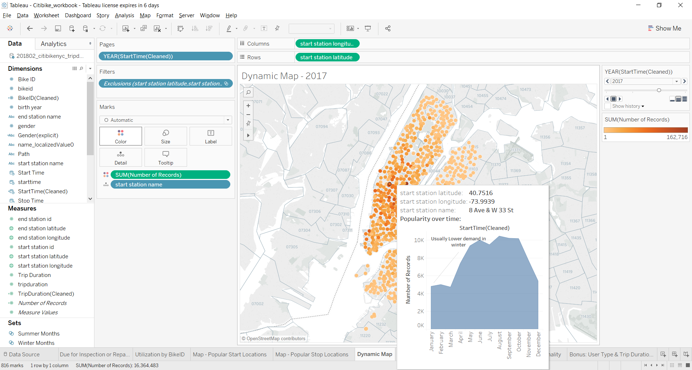

# CitibikeNYC Analysis with Tableu
By Kevin Yao

email: kevinxy00@gmail.com

This project examines the Citibike bike sharing program in New York City. 
The time period of this analysis will be from January 2015 to February 2018.
The resulting pdf report is generated using the Tableu software.

The objective is to answer the following questions:

    * How many trips have been recorded total during the chosen period?
    * By what percentage has total ridership grown? 
    * How has the proportion of short-term customers and annual subscribers changed?
    * What are the peak hours in which bikes are used during summer months? 
    * What are the peak hours in which bikes are used during winter months?
    * What are the top 10 stations in the city for starting a journey? (Based on data, why do you hypothesize these are the top locations?)
    * What are the top 10 stations in the city for ending a journey? (Based on data, why?)
    * What are the bottom 10 stations in the city for starting a journey? (Based on data, why?)
    * What are the bottom 10 stations in the city for ending a journey (Based on data, why?)
    * What is the gender breakdown of active participants (Male v. Female)?
    * How effective has gender outreach been in increasing female ridership over the course of the past three years?
    * How does the average trip duration change by age?
    * What is the average distance in miles that a bike is ridden?
    * Which Bikes (by ID) are most likely due for repair or inspection this year? 
    * How variable is the utilization by bike ID?

    **Additionally, create the following visualizations:**
    * A static map that plots all bike stations with a visual indication of the most popular locations to start and end a journey with zip code data overlaid on top.
    * A dynamic map that shows how each station's popularity changes over time (by month and year) -- with commentary pointing to any interesting events that may be behind these phenomena.

    **Lastly:**
    * Find at least two unexpected phenomena in the data and provide a visualization and analysis to document their presence. 

Dataset source: https://www.citibikenyc.com/system-data

The dataset includes the following: 

    -Trip Duration (seconds)
    -Start Time and Date
    -Stop Time and Date
    -Start Station Name
    -End Station Name
    -Station ID
    -Station Lat/Long
    -Bike ID
    -User Type (Customer = 24-hour pass or 3-day pass user; Subscriber = Annual Member)
    -Gender (Zero=unknown; 1=male; 2=female)
    -Year of Birth
    
Note: Due to the size limitations of github storage, I am not able to conveniently upload the dataset online. 
I can, however, provide it upon request. 
